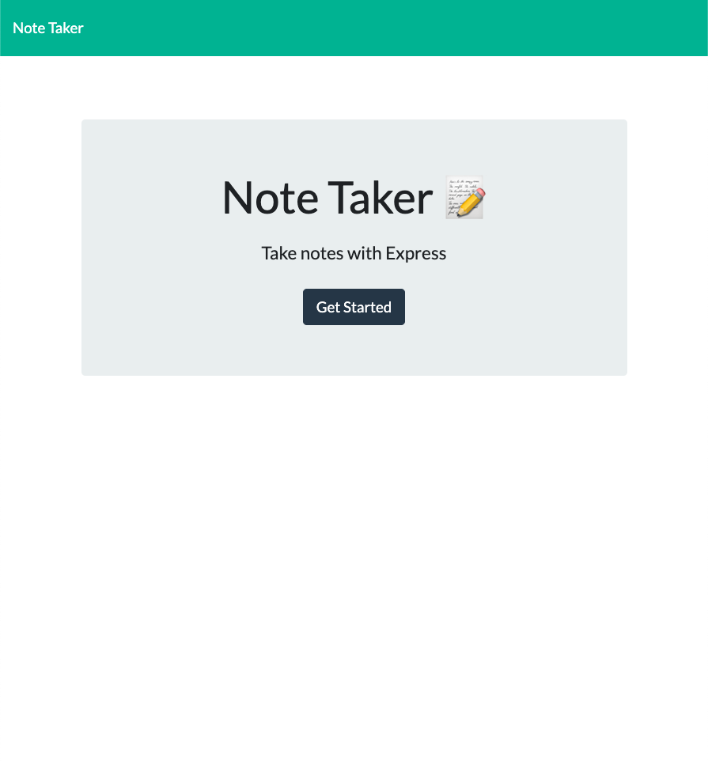
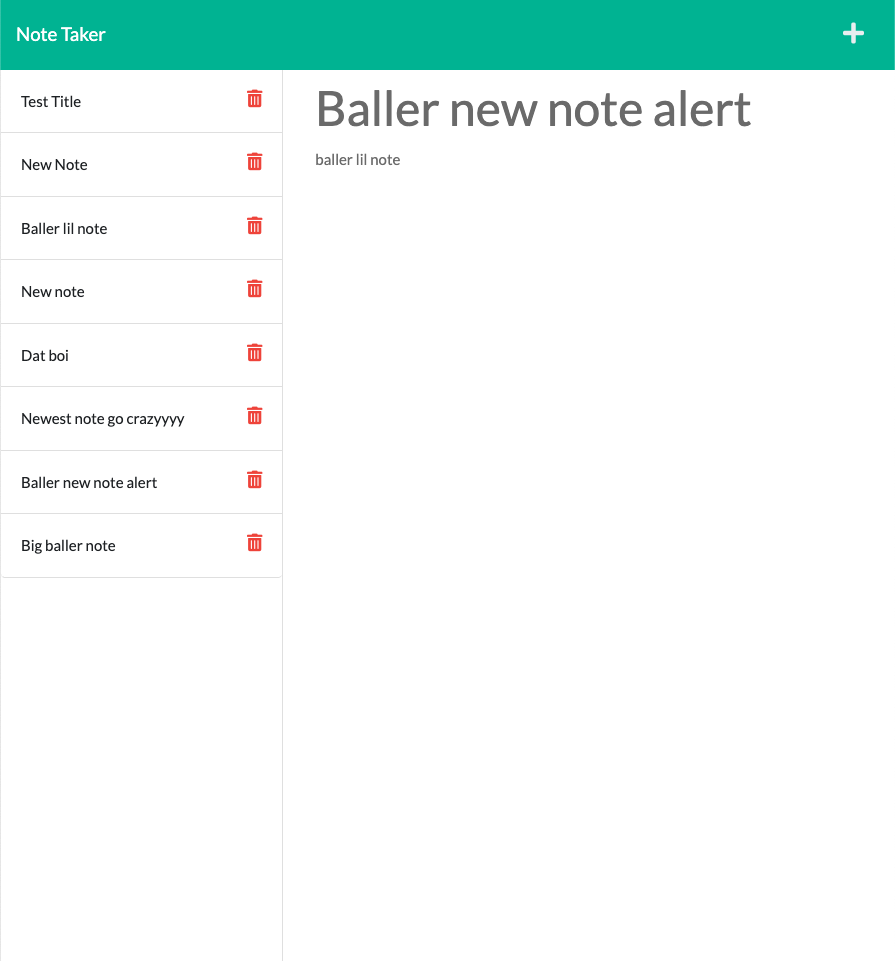
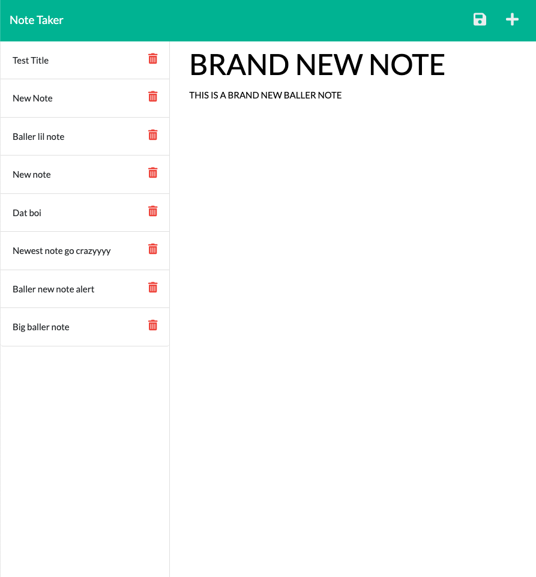

# Express Note Taker Application

## Description
This is a simple application that allows user's to write and save notes. This allows users to keep track of whatever their heart desires while also allowing users to revisit and delete old notes. All of the notes are stored in a backend database so the user always has access to their notes as long as they have a good connection.

## Installation

If you are installing / copying this repository make sure to install the following packages as well:
    - Run 'npm install' to install the needed module packages
            -'express'
            -'uuid'

To spin up the server navigate to the correct directory and enter "node server.js" in your CLI.
This will start the server and is openable at 'http://localhost:3001'
## Usage
Link to the Deployed Application: https://expressnotetaker-et.herokuapp.com

When you first visit the website you will first be greeted by the home screen

Clicking on the get started button will take you to the note taking interface

This interface includes a list of all created notes on the left hand side with the ability to delete any note. On the right hand size is a create note view where users can enter new note information with a title and body. When user have entered a new note with a title and body a save icon will appear in the top right as shown below:

When the save icon is pressed the new note is saved to the database and rendered to the notes list on the left hand side.

## Credits

Starter Code provide by the University of Arizona Bootcamp.

## License
MIT License

Copyright (c) [2023] [EvanTowlerton]

Permission is hereby granted, free of charge, to any person obtaining a copy
of this software and associated documentation files (the "Software"), to deal
in the Software without restriction, including without limitation the rights
to use, copy, modify, merge, publish, distribute, sublicense, and/or sell
copies of the Software, and to permit persons to whom the Software is
furnished to do so, subject to the following conditions:

The above copyright notice and this permission notice shall be included in all
copies or substantial portions of the Software.

THE SOFTWARE IS PROVIDED "AS IS", WITHOUT WARRANTY OF ANY KIND, EXPRESS OR
IMPLIED, INCLUDING BUT NOT LIMITED TO THE WARRANTIES OF MERCHANTABILITY,
FITNESS FOR A PARTICULAR PURPOSE AND NONINFRINGEMENT. IN NO EVENT SHALL THE
AUTHORS OR COPYRIGHT HOLDERS BE LIABLE FOR ANY CLAIM, DAMAGES OR OTHER
LIABILITY, WHETHER IN AN ACTION OF CONTRACT, TORT OR OTHERWISE, ARISING FROM,
OUT OF OR IN CONNECTION WITH THE SOFTWARE OR THE USE OR OTHER DEALINGS IN THE
SOFTWARE.

## Features
N/A
## How to Contribute
-Add more features to the notes like the ability to add pictures
-Add more text editor options like bold / underline / italic etc.

-Modularize routes more
-Utilize a better database then just a db.json file holding all the information

## Tests
N/A
